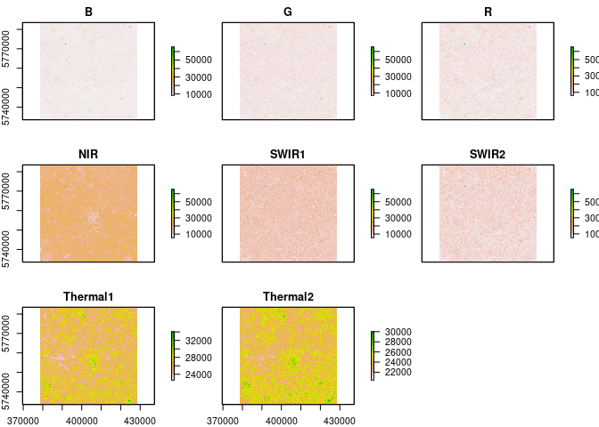
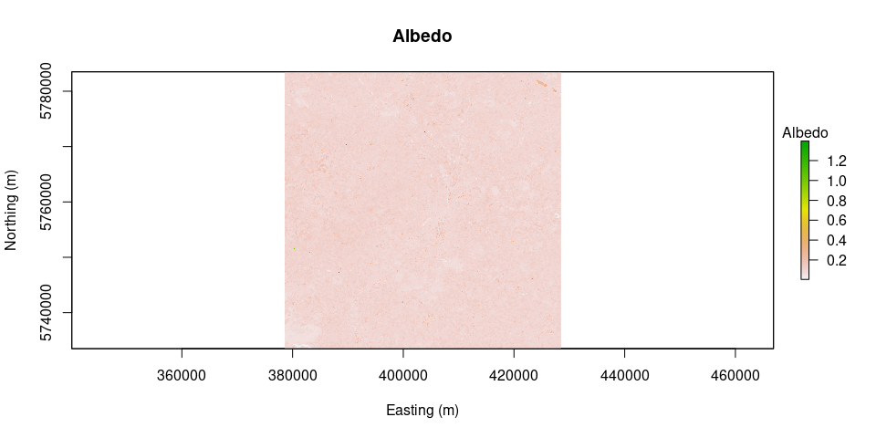
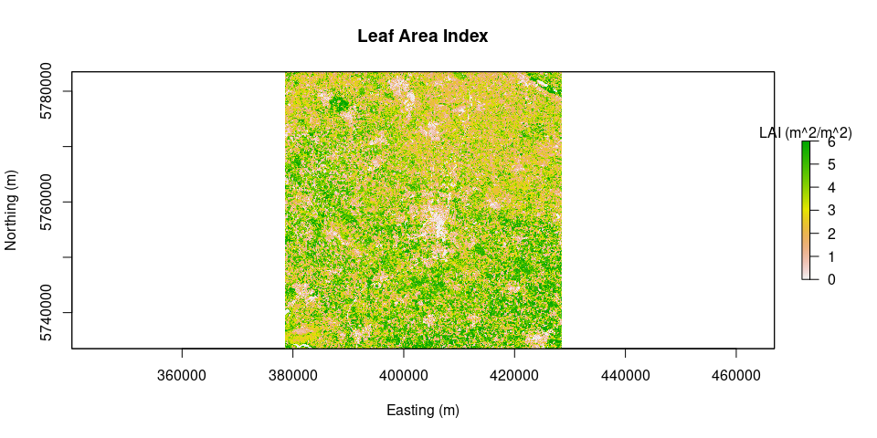
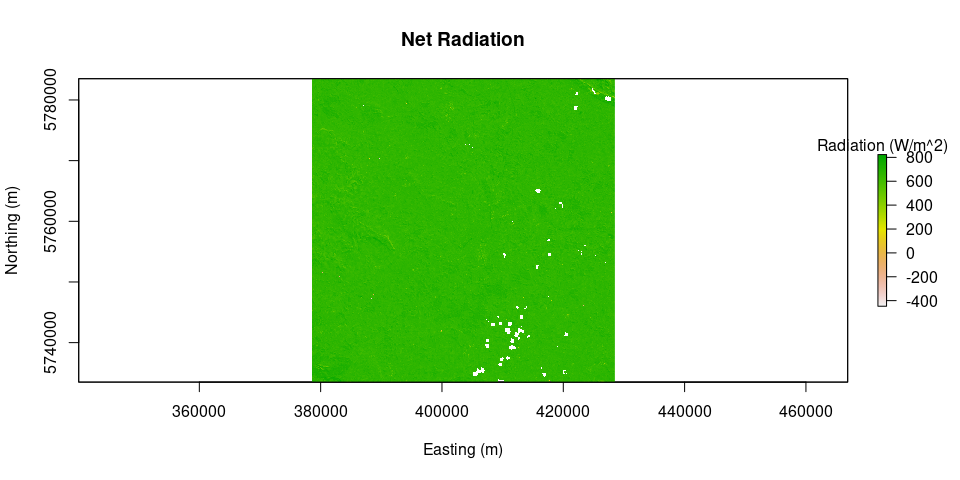
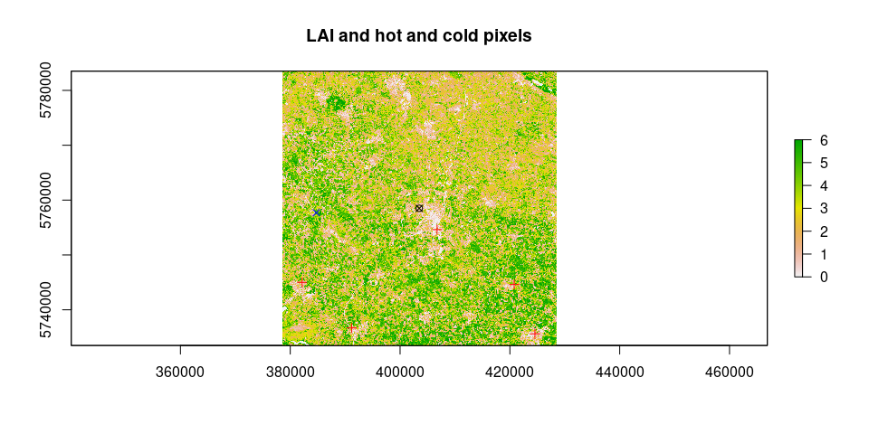
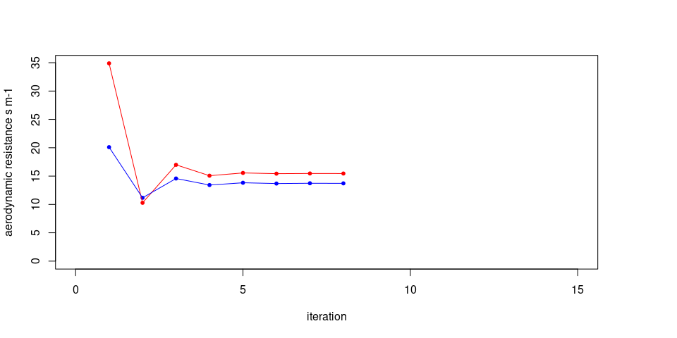
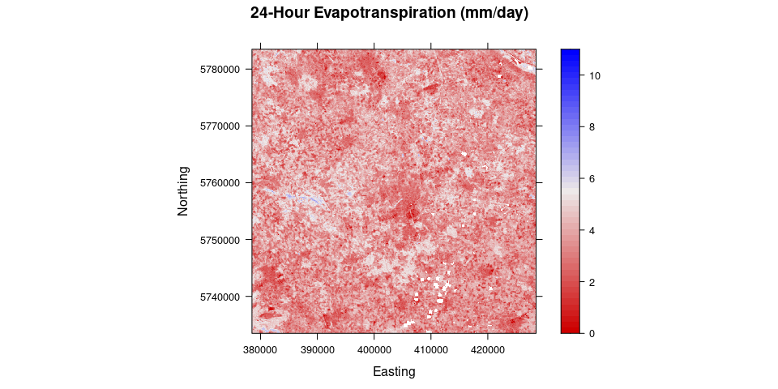

Calculating evapotranspiration using remotely sensed data
================
Pramit Ghosh

## Loading required packages

``` r
library(water)
```

    ## Loading required package: raster

    ## Loading required package: sp

    ## Loading required package: rgdal

    ## rgdal: version: 1.5-23, (SVN revision 1121)
    ## Geospatial Data Abstraction Library extensions to R successfully loaded
    ## Loaded GDAL runtime: GDAL 3.1.3, released 2020/09/01
    ## Path to GDAL shared files: /usr/share/gdal
    ## GDAL binary built with GEOS: TRUE 
    ## Loaded PROJ runtime: Rel. 7.1.0, August 1st, 2020, [PJ_VERSION: 710]
    ## Path to PROJ shared files: /home/pramit/.local/share/proj:/usr/share/proj
    ## PROJ CDN enabled: FALSE
    ## Linking to sp version:1.4-5
    ## To mute warnings of possible GDAL/OSR exportToProj4() degradation,
    ## use options("rgdal_show_exportToProj4_warnings"="none") before loading rgdal.

``` r
library(readr)
```

## Define Area of Interest (AOI)

``` r
# Create AOI (625 sq.km. centered on Muenster FHZ weather station)
utm_x = 403490.150
utm_y = 5758499.100
aoi = createAoi(topleft = c(utm_x - 25000, utm_y + 25000), bottomright = c(utm_x + 25000, utm_y - 25000), EPSG = 32632)
```

## Read Weather Station data

``` r
source("utilities.R")

rain = "data/weather_14-06-2017/Precipitation-data-2021-03-08 12_15_07.csv"
radiation = "data/weather_14-06-2017/Radiation-data-2021-03-08 12_17_32.csv"
humidity = "data/weather_14-06-2017/Relative humidity-data-2021-03-08 12_16_26.csv"
temperature = "data/weather_14-06-2017/Temperature-data-2021-03-08 12_15_39.csv"
wind = "data/weather_14-06-2017/Wind velocity-data-2021-03-08 12_16_05.csv"

weather = read_WS(rain, radiation, humidity, temperature, wind)
```

    ## 
    ## ── Column specification ────────────────────────────────────────────────────────
    ## cols(
    ##   Time = col_datetime(format = ""),
    ##   precipitation.mean = col_double()
    ## )

    ## 
    ## ── Column specification ────────────────────────────────────────────────────────
    ## cols(
    ##   Time = col_datetime(format = ""),
    ##   radiation.mean = col_double()
    ## )

    ## 
    ## ── Column specification ────────────────────────────────────────────────────────
    ## cols(
    ##   Time = col_datetime(format = ""),
    ##   relative_humidity.mean = col_double()
    ## )

    ## 
    ## ── Column specification ────────────────────────────────────────────────────────
    ## cols(
    ##   Time = col_datetime(format = ""),
    ##   `temperature.mean {measurement_interpolationtype: Continuous_Instantaneous, sensor_device: WS301}` = col_double()
    ## )

    ## 
    ## ── Column specification ────────────────────────────────────────────────────────
    ## cols(
    ##   Time = col_datetime(format = ""),
    ##   wind_velocity.mean = col_double()
    ## )

``` r
weather_time = format(weather$Time, format = "%H:%M:%S")
weather$Time = format(weather$Time, format = "%d/%m/%Y")
weather = cbind(weather_time, weather)
colnames(weather) = c("time", "date", "precipitation", "radiation", "rel_humidity", "temperature", "wind_vel")
```

## Calculate data values at satellite overpass

``` r
MTLfile = "data/L8_C2/LC08_L1TP_197024_20170614_20200903_02_T1_MTL.txt"
WeatherStation = sat_overpass(L8_L2_MTL = MTLfile, weather = weather, lat = 51.968791, long = 7.59513, elev = 60, height = 2)
```

    ## Warning in read.WSdata(WSdata = weather, date.format = "%d/%m/%Y", lat = lat, :
    ## As tz = "", assuming the weather station time zone is Europe/Berlin

    ## Weather Station @ lat: 51.97 long: 7.6 elev: 60 
    ## Summary:
    ##    radiation          wind             RH              ea             temp     
    ##  Min.   :  0.0   Min.   :0.667   Min.   :34.40   Min.   :1.023   Min.   : 8.3  
    ##  1st Qu.:  0.0   1st Qu.:1.500   1st Qu.:40.88   1st Qu.:1.118   1st Qu.:11.9  
    ##  Median :235.5   Median :2.000   Median :53.65   Median :1.152   Median :18.8  
    ##  Mean   :327.0   Mean   :2.202   Mean   :61.76   Mean   :1.155   Mean   :17.6  
    ##  3rd Qu.:681.0   3rd Qu.:2.900   3rd Qu.:85.70   3rd Qu.:1.193   3rd Qu.:23.0  
    ##  Max.   :894.0   Max.   :4.800   Max.   :97.10   Max.   :1.315   Max.   :25.1  
    ##       rain  
    ##  Min.   :0  
    ##  1st Qu.:0  
    ##  Median :0  
    ##  Mean   :0  
    ##  3rd Qu.:0  
    ##  Max.   :0  
    ## 
    ##  Conditions at satellite flyby:
    ##                datetime radiation wind    RH  ea  temp rain       date
    ## 434 2017-06-14 12:27:22    789.38 3.19 41.39 1.2 23.47    0 2017-06-14

<!-- -->

## Load Landsat 8 Level-2 data

``` r
source("remove_negatives.R")
L8 = loadImage(path = "data/L8_C2/", sat = "L8", aoi = aoi)
```

    ## Warning in `[<-`(`*tmp*`, i, value = raster(list.files(path = path, pattern =
    ## paste0(image_pattern, : implicit list embedding of S4 objects is deprecated

    ## Warning in `[<-`(`*tmp*`, i, value = raster(list.files(path = path, pattern =
    ## paste0(image_pattern, : implicit list embedding of S4 objects is deprecated

    ## Warning in `[<-`(`*tmp*`, i, value = raster(list.files(path = path, pattern =
    ## paste0(image_pattern, : implicit list embedding of S4 objects is deprecated

    ## Warning in `[<-`(`*tmp*`, i, value = raster(list.files(path = path, pattern =
    ## paste0(image_pattern, : implicit list embedding of S4 objects is deprecated

    ## Warning in `[<-`(`*tmp*`, i, value = raster(list.files(path = path, pattern =
    ## paste0(image_pattern, : implicit list embedding of S4 objects is deprecated

    ## Warning in `[<-`(`*tmp*`, i, value = raster(list.files(path = path, pattern =
    ## paste0(image_pattern, : implicit list embedding of S4 objects is deprecated

    ## Warning in `[<-`(`*tmp*`, i, value = raster(list.files(path = path, pattern =
    ## paste0(image_pattern, : implicit list embedding of S4 objects is deprecated

    ## Warning in `[<-`(`*tmp*`, i, value = raster(list.files(path = path, pattern =
    ## paste0(image_pattern, : implicit list embedding of S4 objects is deprecated

``` r
L8 = remove_negatives(L8)
plot(L8)
```

<!-- -->

## Load Surface Reflectance data

``` r
source("loadSR.R")
source("calcAlbedo.R")
L8.SR = loadSR(path = "data/L8_C2/SR/", aoi = aoi)
```

    ## Warning in `[<-`(`*tmp*`, i, value = raster(files[i])): implicit list embedding
    ## of S4 objects is deprecated

    ## Warning in `[<-`(`*tmp*`, i, value = raster(files[i])): implicit list embedding
    ## of S4 objects is deprecated

    ## Warning in `[<-`(`*tmp*`, i, value = raster(files[i])): implicit list embedding
    ## of S4 objects is deprecated

    ## Warning in `[<-`(`*tmp*`, i, value = raster(files[i])): implicit list embedding
    ## of S4 objects is deprecated

    ## Warning in `[<-`(`*tmp*`, i, value = raster(files[i])): implicit list embedding
    ## of S4 objects is deprecated

    ## Warning in `[<-`(`*tmp*`, i, value = raster(files[i])): implicit list embedding
    ## of S4 objects is deprecated

    ## Warning in `[<-`(`*tmp*`, i, value = raster(files[i])): implicit list embedding
    ## of S4 objects is deprecated

``` r
L8.SR = remove_negatives(L8.SR)
L8.SR = L8_SR(L8.SR)
plot(L8.SR)
```

<!-- -->

## Load Digital Elevation Model

``` r
checkSRTMgrids(L8)
```

    ## Warning in showSRID(uprojargs, format = "PROJ", multiline = "NO", prefer_proj
    ## = prefer_proj): Discarded datum Unknown based on WGS84 ellipsoid in Proj4
    ## definition

    ## [1] "You need 2 1deg x 1deg SRTM grids"
    ## [1] "You can get them here:"

    ## [1] "http://earthexplorer.usgs.gov/download/options/8360/SRTM1N51E07V3/"
    ## [2] "http://earthexplorer.usgs.gov/download/options/8360/SRTM1N52E07V3/"

``` r
DEM = prepareSRTMdata(path = "data/SRTM_DEM/", extent = L8)
plot(DEM, main = "Digital Elevation Model", legend.args = list(text = 'Elevation (m)'), xlab = "Easting (m)", ylab = "Northing (m)")
```

<!-- -->

## Calculate solar angles

``` r
surface.model = METRICtopo(DEM)
solar.angles.r = solarAngles(surface.model = surface.model, WeatherStation = WeatherStation, MTLfile)
# plot(solar.angles.r)
```

## Calculate intermediate results

### Calculate incident short-wave radiation

``` r
Rs.inc = incSWradiation(surface.model = surface.model, solar.angles = solar.angles.r, WeatherStation = WeatherStation)
plot(Rs.inc, main = "Incident short-wave radiation", legend.args = list(text = 'Radiation (W/m^2)'), xlab = "Easting (m)", ylab = "Northing (m)")
```

<!-- -->

### Calculate Top-of-Atmosphere reflectance

``` r
image.TOAr = calcTOAr(image.DN = L8, sat = "L8", MTL = MTLfile, incidence.rel = solar.angles.r$incidence.rel, aoi = aoi)
plot(image.TOAr)
```

<!-- -->

``` r
# image.SR = calcSR(image.TOAr = image.TOAr, sat = "L7", surface.model = surface.model, incidence.hor = solar.angles.r$incidence.hor, WeatherStation = WeatherStation)
```

### Calculate Albedo

``` r
# albedo = albedo(image.SR = L8.SR, coeff = "Olmedo", sat = "L8")
# albedo = albedo - 1 #To compensate for too high albedo! (needs more investigation)
albedo = albedo.daSilva(L8.SR)
plot(albedo, main = "Albedo", legend.args = list(text = 'Albedo'), xlab = "Easting (m)", ylab = "Northing (m)")
```

<!-- -->

## Calculate Leaf Area Index

``` r
LAI = LAI(method = "metric2010", image = image.TOAr, L = 0.1)
plot(LAI, main = "Leaf Area Index", legend.args = list(text = 'LAI (m^2/m^2)'), xlab = "Easting (m)", ylab = "Northing (m)")
```

<!-- -->

## Calculate further intermediate results

``` r
source("calcLST.R")
```

### Calculate Surface Temperature

``` r
source("calcLST.R")

L8.ST = loadST(path = "data/L8_C2/SR/", aoi = aoi)
Ts = calcLST(L8.ST)
# Ts = surfaceTemperature(image.DN = L8, LAI = LAI, sat = "L8", WeatherStation = WeatherStation, aoi = aoi, method = "SW")
plot(Ts, main = "Surface Temperature", legend.args = list(text = 'Temperature (K)'), xlab = "Easting (m)", ylab = "Northing (m)")
```

<!-- -->

### Calculate incident and outgoing long-wave radiation

``` r
Rl.out = outLWradiation(LAI = LAI, Ts = Ts)
Rl.inc = incLWradiation(WeatherStation = WeatherStation, DEM = surface.model$DEM, solar.angles = solar.angles.r, Ts = Ts)
plot(Rl.out, main = "Outgoing long-wave radiation", legend.args = list(text = 'Radiation (W/m^2)'), xlab = "Easting (m)", ylab = "Northing (m)")
```

<!-- -->

``` r
plot(Rl.inc, main = "Incoming long-wave radiation", legend.args = list(text = 'Radiation (W/m^2)'), xlab = "Easting (m)", ylab = "Northing (m)")
```

<!-- -->

## Calculate Net radiation

``` r
Rn = netRadiation(LAI, albedo, Rs.inc, Rl.inc, Rl.out)
plot(Rn, main = "Net Radiation", legend.args = list(text = 'Radiation (W/m^2)'), xlab = "Easting (m)", ylab = "Northing (m)")
```

<!-- -->

## Calculate Soil Heat Flux

``` r
G = soilHeatFlux(image = L8.SR, Ts = Ts, albedo = albedo, Rn = Rn, LAI = LAI)
plot(G, main = "Soil Heat Flux", legend.args = list(text = 'Radiation (W/m^2)'), xlab = "Easting (m)", ylab = "Northing (m)")
```

<!-- -->

## Calculate Sensible Heat flux

``` r
source("calcAnchors.R")

Z.om = momentumRoughnessLength(LAI = LAI, mountainous = FALSE, method = "short.crops", surface.model = surface.model)
hot.and.cold = calculate_anchors(image = image.TOAr, Ts, LAI, Rn = Rn, G = G, plots = TRUE, albedo = albedo, Z.om = Z.om, n = 5, anchors.method = "flexible", WeatherStation = WeatherStation, verbose = TRUE)
```

    ## [1] "relaxing criteria for cold pixels: 0.1%"
    ## [1] "relaxing criteria for cold pixels: 0.2%"
    ## [1] "relaxing criteria for cold pixels: 0.3%"
    ## [1] "relaxing criteria for cold pixels: 0.4%"

    ## Warning in calculate_anchors(image = image.TOAr, Ts, LAI, Rn = Rn, G = G, : Criteria used for cold pixels was:
    ##     LAI: 1.8 to 8.4 
    ##     albedo: 0.108 to 0.35 
    ##     Z.om: 0.018 to 0.112 
    ##     and buffer == TRUE

    ## Warning in calculate_anchors(image = image.TOAr, Ts, LAI, Rn = Rn, G = G, : I
    ## can only find 1 anchors with cold pixel conditions

    ## [1] "Cold pixels"
    ##     pixel      LAI      NDVI    albedo      Z.om       Ts
    ## 1 1433829 5.880326 0.8265637 0.1084798 0.1058459 289.5251
    ## [1] "Hot pixels"
    ##     pixel        LAI      NDVI    albedo         Z.om       Ts
    ## 1 2662068 0.01109450 0.1078400 0.1330022 0.0001997010 319.2242
    ## 2 2161842 0.01396456 0.1123579 0.1474046 0.0002513621 318.9986
    ## 3 2600944 0.02056580 0.1342561 0.1315451 0.0003701843 316.9923
    ## 4 2138884 0.01001867 0.1039880 0.1428028 0.0001803361 315.9190
    ## 5 1604596 0.19731386 0.2798715 0.1324220 0.0035516494 315.6456

<!-- -->

``` r
# hot.and.cold = calcAnchors(image = image.TOAr, Ts, LAI, plots = TRUE, albedo = albedo, Z.om = Z.om, n = 5, anchors.method = "flexible", WeatherStation = WeatherStation, verbose = TRUE)
H = calcH(anchors = hot.and.cold, mountainous = FALSE, Ts = Ts, Z.om = Z.om, WeatherStation = WeatherStation, ETp.coef = 1.05, Z.om.ws = 0.03, DEM = DEM, Rn = Rn, G = G, verbose = TRUE)
```

    ## [1] "starting conditions"
    ## [1] "Cold"
    ##         Ts Ts_datum       Rn        G      Z.om     u200       u.
    ## 1 289.5251 288.9248 653.5944 38.17583 0.1058459 6.687982 0.363473
    ## [1] "Hot"
    ##         Ts Ts_datum       Rn        G         Z.om     u200        u.
    ## 1 317.3559 317.2847 596.2919 129.6412 0.0009106466 6.687982 0.2111376
    ## 2 317.3559 317.2847 596.2919 129.6412 0.0009106466 6.687982 0.2111376
    ## 3 317.3559 317.2847 596.2919 129.6412 0.0009106466 6.687982 0.2111376
    ## 4 317.3559 317.2847 596.2919 129.6412 0.0009106466 6.687982 0.2111376
    ## 5 317.3559 317.2847 596.2919 129.6412 0.0009106466 6.687982 0.2111376

<!-- -->

    ## [1] "iteraction # 1"
    ## [1] "a 0.403483733501788"
    ## [1] "b -113.172049454027"
    ## [1] "r.ah cold 20.1023564077358"
    ## [1] "r.ah hot 34.886362499962"
    ## [1] "dT cold 3.40442661280836"
    ## [1] "dT hot 14.8471600621615"
    ## [1] "##############"
    ## [1] "delta rah hot -239.070390583248"
    ## [1] "delta rah cold -79.9043804608365"
    ## [1] "### -------"
    ## [1] "iteraction # 2"
    ## [1] "a 0.0876743588157654"
    ## [1] "b -23.4389473543822"
    ## [1] "r.ah cold 11.1739115836103"
    ## [1] "r.ah hot 10.2888259986231"
    ## [1] "dT cold 1.89235337354638"
    ## [1] "dT hot 4.37878401491275"
    ## [1] "##############"
    ## [1] "delta rah hot 39.4311626003387"
    ## [1] "delta rah cold 23.3393127533587"
    ## [1] "### -------"
    ## [1] "iteraction # 3"
    ## [1] "a 0.167876637123742"
    ## [1] "b -46.0352522048575"
    ## [1] "r.ah cold 14.5758040854243"
    ## [1] "r.ah hot 16.986996020301"
    ## [1] "dT cold 2.46847953170325"
    ## [1] "dT hot 7.22943381927491"
    ## [1] "##############"
    ## [1] "delta rah hot -12.7255412788687"
    ## [1] "delta rah cold -8.60580208407304"
    ## [1] "### -------"
    ## [1] "iteraction # 4"
    ## [1] "a 0.145996105463325"
    ## [1] "b -39.9090224898963"
    ## [1] "r.ah cold 13.4208336992355"
    ## [1] "r.ah hot 15.0693408322408"
    ## [1] "dT cold 2.27287997909391"
    ## [1] "dT hot 6.41330592628535"
    ## [1] "##############"
    ## [1] "delta rah hot 3.1402828496324"
    ## [1] "delta rah cold 2.92615763606719"
    ## [1] "### -------"
    ## [1] "iteraction # 5"
    ## [1] "a 0.150911949657984"
    ## [1] "b -41.2608191779961"
    ## [1] "r.ah cold 13.8253862960533"
    ## [1] "r.ah hot 15.55790299165"
    ## [1] "dT cold 2.34139282400382"
    ## [1] "dT hot 6.62123131779247"
    ## [1] "##############"
    ## [1] "delta rah hot -0.830322758588457"
    ## [1] "delta rah cold -1.02075946205143"
    ## [1] "### -------"
    ## [1] "iteraction # 6"
    ## [1] "a 0.149823566664598"
    ## [1] "b -40.9700167803847"
    ## [1] "r.ah cold 13.6856883374024"
    ## [1] "r.ah hot 15.4297859671632"
    ## [1] "dT cold 2.31773433150972"
    ## [1] "dT hot 6.56670645956896"
    ## [1] "##############"
    ## [1] "delta rah hot 0.2154256860821"
    ## [1] "delta rah cold 0.352861364974579"
    ## [1] "### -------"
    ## [1] "iteraction # 7"
    ## [1] "a 0.150034060233812"
    ## [1] "b -41.022626253151"
    ## [1] "r.ah cold 13.7341508495578"
    ## [1] "r.ah hot 15.4630974509364"
    ## [1] "dT cold 2.32594168107407"
    ## [1] "dT hot 6.58088337272492"
    ## [1] "##############"
    ## [1] "convergence reached at iteration #8"
    ## [1] "delta rah hot -0.0562136388715297"
    ## [1] "delta rah cold -0.122359807426774"
    ## [1] "### -------"

## Calculate 24h evapotranspiration

``` r
# Calculate 24h evapotranspiration
ET_WS = dailyET(WeatherStation = WeatherStation, lat = 51.968791, long = 7.59513, elev = 60, height = 2)
ET.24 = ET24h(Rn, G, H$H, Ts, WeatherStation = WeatherStation, ETr.daily = ET_WS)
```

<!-- -->

## Validation

### Comparing evapotranspiration for different LULC classes

``` r
source("validation.R")
```

    ## Linking to GEOS 3.8.1, GDAL 3.1.3, PROJ 7.1.0

``` r
leo_coords = c(403873.8,    5759162)
leo_val = val_at_coords(image = ET.24, coord_pair = leo_coords)
print(paste("24 hours ET value calculated at LEO Campus = ", leo_val, " mm/d", sep = ""))
```

    ## [1] "24 hours ET value calculated at LEO Campus = 2.24090746282457 mm/d"

``` r
fmo_coords = c(411014.92, 5776294.31)
fmo_val = val_at_coords(image = ET.24, coord_pair = fmo_coords)
print(paste("24 hours ET value calculated at FMO Airport = ", fmo_val, " mm/d", sep = ""))
```

    ## [1] "24 hours ET value calculated at FMO Airport = 2.47470191506715 mm/d"

``` r
vpts = read_sf("results/pts.gpkg")
pts_geom = st_geometry(vpts)
ET_pts = lapply(X = pts_geom, FUN = function(x, img) val_at_coords(img, as.numeric(x)), ET.24)
val_results = as.data.frame(cbind(vpts$LULC, as.numeric(unlist(ET_pts))))
val_results$V2 = as.numeric(val_results$V2)
colnames(val_results) = c("LULC", "ET")

boxplot(val_results$ET ~ val_results$LULC, main = "Daily evapotranspiration for different LULC classes", sub = "(20 samples per class)", xlab = "LULC class", ylab = "Evapotranspiration (mm/d)")
```

<!-- -->

### Comparison with climate station time-series data

``` r
ET_results = readRDS("results/ET_results.Rds")
```

#### At Flughafen Münster/Osnabrück (FMO)

Assuming `ET_results` is present in the environment (after running
`ET_func.R`):

``` r
fmo_coords = c(409569.18, 5776377.16)
ET_FMO = data.frame("Date" = sapply(ET_results, function(img_list){as.character(img_list[[1]])}),
                    "PET_RS" = sapply(ET_results, function(img_list){img_list[[2]]}),
                    "ET_RS" = sapply(ET_results, function(img_list){val_at_coords(img_list[[3]], fmo_coords)}))

FMO_DWD = read_csv("data/weather_FMO/klima_1989-2020_MünsterOsnabrück.csv",
                   col_types = cols(STATIONS_ID = col_skip(),
                                    MESS_DATUM = col_datetime(format = "%Y-%m-%d %H:%M:%S UTC"),
                                    QN_3 = col_skip(), FX.Windspitze = col_skip(),
                                    FM.Windgeschwindigkeit = col_skip(),
                                    QN_4 = col_skip(), RSK.Niederschlagshoehe = col_skip(),
                                    RSKF.Niederschlagsform = col_skip(),
                                    SDK.Sonnenscheindauer = col_skip(),
                                    SHK_TAG.Schneehoehe = col_skip(),
                                    NM.Bedeckungsgrad = col_skip(), VPM.Dampfdruck = col_skip(),
                                    PM.Luftdruck = col_skip(), TMK.Lufttemperatur = col_skip(),
                                    UPM.Relative_Feuchte = col_skip(),
                                    TXK.Lufttemperatur_Max = col_skip(),
                                    TNK.Lufttemperatur_Min = col_skip(),
                                    TGK.Lufttemperatur_5cm_min = col_skip(),
                                    eor = col_skip()))
colnames(FMO_DWD) = c("Date", "ET_DWD")
FMO_DWD$Date = as.character(FMO_DWD$Date)

ET_comparison = merge(x = FMO_DWD, y = ET_FMO, all.y = TRUE)
ET_cor = cor(ET_comparison$ET_DWD, y = ET_comparison$ET_RS)
max_ET = max(ET_comparison$ET_DWD, ET_comparison$PET_RS, ET_comparison$ET_RS)

plot(ET_comparison$ET_DWD, ET_comparison$ET_RS,
     xlab = "Daily ET from Climate station (mm/d)",
     ylab = "Daily ET from Remote Sensing (mm/d)",
     main = "Comparison of daily ET values with climate station data",
     xlim = c(0, max_ET), ylim = c(0, max_ET))
abline(0, 1, col = "Blue", lty = 3)
points(x = ET_comparison$ET_DWD, y = ET_comparison$PET_RS, pch = 4, col = "darkgreen")
legend(x = "topleft", legend = c("Actual ET from remote sensing data", "Potential ET from remote sensing data"), col = c("black", "darkgreen"), pch = c(1,4),
       cex = 0.8, inset = 0.01)
```

<!-- -->

``` r
plot(ET_comparison$ET_DWD ~ as.POSIXct(ET_comparison$Date, format = "%Y-%m-%d"), xaxt = "none", ylab = "Evapotranspiration (mm/d)", xlab = "", type = "b", lty = 2, col = "blue", main = "Daily Evapotranspiration at Flughafen Münster/Osnabrück", ylim = c(0, max_ET))
axis(1, at = as.POSIXct(ET_FMO$Date, format = "%Y-%m-%d"), labels = format(as.POSIXct(ET_FMO$Date, format = "%Y-%m-%d"), format = "%m/%Y"), las = 2, cex.axis = 0.8)
title(xlab = "Time", line = 4)
par(new = TRUE)
plot(ET_comparison$ET_RS ~ as.POSIXct(ET_comparison$Date, format = "%Y-%m-%d"), xlab = "", ylab = "", axes = FALSE, type = "b", lty = 2, col = "black")
par(new = TRUE)
plot(ET_comparison$PET_RS ~ as.POSIXct(ET_comparison$Date, format = "%Y-%m-%d"), xlab = "", ylab = "", axes = FALSE, type = "b", lty = 2, col = "darkgreen", pch = 4)
legend(title = "ET calculated using data from", x = "bottomleft", legend = c("Remote Sensing (actual)", "Remote Sensing (potential)", "Climate Station (potential)"), col = c("black", "darkgreen", "blue"), lty = 2, cex = 0.8, inset = 0.01, pch = c(1,4,1), title.adj = 0.1, seg.len = 3)
```

<!-- --> **Note:
Potential ET from Remote Sensing, as shown above, is calculated at the
location of the Weather Station and not at the location for which the
Actual ET from Remote Sensing is calculated!**

#### At Leonardo Campus, Münster

``` r
leo_coords = c(403873.8,    5759162)
ET_Leo = data.frame("Date" = sapply(ET_results, function(img_list){as.character(img_list[[1]])}),
                    "PET_RS" = sapply(ET_results, function(img_list){img_list[[2]]}),
                    "ET_RS" = sapply(ET_results, function(img_list){val_at_coords(img_list[[3]], leo_coords)}))
PET_Leo = read_table2("data/ETp_Leo_correctedNA.dat",
                      col_names = FALSE, col_types = cols(X1 = col_date(format = "%m/%d/%Y"),
                                                          X2 = col_time(format = "%H:%M")),
                      skip = 1)
colnames(PET_Leo) = c("Date", "Time", "PET")
Leo_FH = aggregate(x = PET_Leo, by = list(PET_Leo$Date), FUN = mean)[, c("Date", "PET")]
Leo_FH$Date = as.character(Leo_FH$Date)
Leo_ET_comparison = merge(x = Leo_FH, y = ET_Leo, all.y = TRUE)

Leo_max_ET = max(Leo_ET_comparison$PET, Leo_ET_comparison$PET_RS, Leo_ET_comparison$ET_RS, na.rm = TRUE)

plot(Leo_ET_comparison$PET, Leo_ET_comparison$ET_RS,
     xlab = "Daily ET from Climate station (mm/d)",
     ylab = "Daily ET from Remote Sensing (mm/d)",
     main = "Comparison of daily ET values with climate station data",
     xlim = c(0, Leo_max_ET), ylim = c(0, Leo_max_ET))
abline(0, 1, col = "Blue", lty = 3)
points(x = Leo_ET_comparison$PET, y = Leo_ET_comparison$PET_RS, pch = 4, col = "darkgreen")
legend(x = "topleft", legend = c("Actual ET from remote sensing data", "Potential ET from remote sensing data"), col = c("black", "darkgreen"), pch = c(1,4),
       cex = 0.8, inset = 0.01)
```

<!-- -->

``` r
plot(Leo_ET_comparison$PET ~ as.POSIXct(Leo_ET_comparison$Date, format = "%Y-%m-%d"), xaxt = "none", ylab = "Evapotranspiration (mm/d)", xlab = "", type = "b", lty = 2, col = "blue", main = "Daily Evapotranspiration at Leonardo Campus", ylim = c(0, Leo_max_ET))
axis(1, at = as.POSIXct(ET_Leo$Date, format = "%Y-%m-%d"), labels = format(as.POSIXct(ET_Leo$Date, format = "%Y-%m-%d"), format = "%m/%Y"), las = 2, cex.axis = 0.8)
title(xlab = "Time", line = 4)
par(new = TRUE)
plot(Leo_ET_comparison$ET_RS ~ as.POSIXct(Leo_ET_comparison$Date, format = "%Y-%m-%d"), xlab = "", ylab = "", axes = FALSE, type = "b", lty = 2, col = "black")
par(new = TRUE)
plot(Leo_ET_comparison$PET_RS ~ as.POSIXct(Leo_ET_comparison$Date, format = "%Y-%m-%d"), xlab = "", ylab = "", axes = FALSE, type = "b", lty = 2, col = "darkgreen", pch = 4)
legend(title = "ET calculated using data from", x = "bottomleft", legend = c("Remote Sensing (actual)", "Remote Sensing (potential)", "Climate Station (potential)"), col = c("black", "darkgreen", "blue"), lty = 2, cex = 0.8, inset = 0.01, pch = c(1,4,1), title.adj = 0.1, seg.len = 2)
```

<!-- --> **Note:
Potential ET from Remote Sensing, as shown above, is calculated at the
location of the Weather Station and not at the location for which the
Actual ET from Remote Sensing is calculated!**
